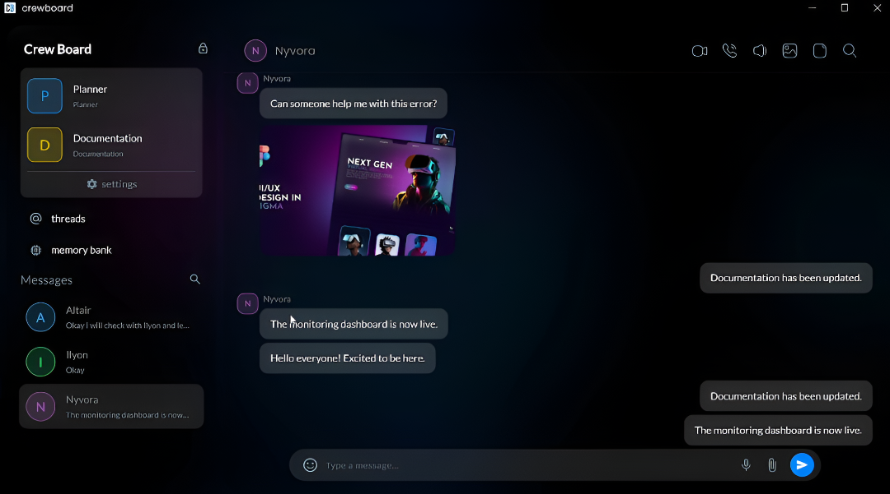

# Crewboard

[](https://youtu.be/cqfBFUfqoOw)

Crewboard involves a complete Serverpod 3 setup with a Flutter client app and a separate landing page project.

## Project Structure

- `crewboard_server`: The server-side code (Serverpod).
- `crewboard_client`: The generated Dart client code (shared between server and Flutter apps).
- `crewboard_flutter`: The main Flutter application.
- `landing`: A separate Flutter Web project for the landing page.

## Prerequisites

Before you begin, ensure you have the following installed:

- **Flutter SDK**: [Install Flutter](https://docs.flutter.dev/get-started/install)
- **Docker Desktop**: [Install Docker](https://docs.docker.com/get-docker/) (Required for the database)
- **Serverpod CLI**:
  ```bash
  dart pub global activate serverpod_cli
  ```

## Getting Started

### 1. Start the Server

1.  Navigate to the server directory:
    ```bash
    cd crewboard_server
    ```

2.  Start the database (Postgres + Redis) using Docker:
    ```bash
    docker-compose up --build --detach
    ```

3.  Apply database migrations and generate definition:
    ```bash
    dart run bin/main.dart --apply-migrations
    ```
    *(Note: If this is the first run or you don't have migrations yet, `serverpod create-migration` might be needed first if you modified models, but `apply-migrations` is standard for startup with existing migrations)*

4.  Start the server:
    ```bash
    dart run bin/main.dart
    ```

### 2. Run the Counter/Crewboard App

1.  Navigate to the Flutter app directory:
    ```bash
    cd crewboard_flutter
    ```

2.  Get dependencies:
    ```bash
    flutter pub get
    ```

3.  Run the app:
    ```bash
    flutter run
    ```

### 3. Run the Landing Page

1.  Navigate to the landing page directory:
    ```bash
    cd landing
    ```

2.  Get dependencies:
    ```bash
    flutter pub get
    ```

3.  Run the web app:
    ```bash
    flutter run -d chrome
    ```

## Development

### Generating Code

If you modify protocol files in `crewboard_server`, you must regenerate the client code:

```bash
cd crewboard_server
serverpod generate
```
